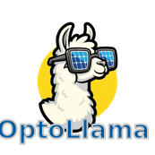

<div align="center">
  
</div>

-----------

[](https://www.python.org/downloads/)
[](https://opensource.org/license/apache-2-0)
[](jonas.schaible@helmholtz-berlin.de)
[](https://github.com/astral-sh/ruff)

OptoLlama is a transformer AI-model enabling the inverse design of thin-film material stacks. Given an reflectance-absorptance-transmittance input spectrum (RAT), OptoLlama is able to propose a corresponding stack of materials and their layer thickness producing the "prompted" characteristics.

## Installation
We heavily recommend installing the `OptoLlama` package in a dedicated `Python3.11+` virtual environment. You can
install ``OptoLlama`` directly from the GitHub repository via:
```bash
pip install git+https://github.com/jnitzz/OptoLlama
```
Alternatively, you can install ``OptoLlama`` locally. To achieve this, there are two steps you need to follow:
1. Clone the `OptoLlama` repository:
   ```bash
   git clone git@github.com:jnitzz/OptoLlama.git
   ```
2. Install the package from the main branch:
   - Install basic dependencies: ``pip install -e .``
  
### As a developer

If you want to contribute to Propulate as a developer, you need to install the required dependencies with the package.

```bash
pip install -e ."[dev]"
```
  
## Data and model checkpoints

You can find all necessary data on our [HuggingFace](https://huggingface.co/HZBSolarOptics) page. It contains the [training and test data](https://huggingface.co/datasets/HZBSolarOptics/MultiLayerThinFilms) as well as the [model checkpoint](https://huggingface.co/HZBSolarOptics/OptoLlama). The data is stored in the [safetensors](https://huggingface.co/docs/safetensors/index) format. Please find a small usage example below:

```python
from safetensors.torch import load_file

model = OptoLlama()

safetensors_path = "optollama-model.safetensors"
state_dict = load_file(safetensors_path)
model.load_state_dict(state_dict)
```

## How to contribute
Check out our [contribution guidelines](CONTRIBUTING.md) if you are interested in contributing to the `OptoLlama` project :fire:.
Please also carefully check our [code of conduct](CODE_OF_CONDUCT.md) :blue_heart:.

## Acknowledgments
This work is supported by the [Helmholtz AI](https://www.helmholtz.ai/) platform grant.

-----------
<div align="center">
  <a href="https://www.helmholtz-berlin.de/index_en.html"></a>
  <a href="http://www.kit.edu/english/index.php"></a>
  <a href="https://www.zib.de/"></a>
  <a href="https://www.helmholtz.ai/"></a>
</div>
